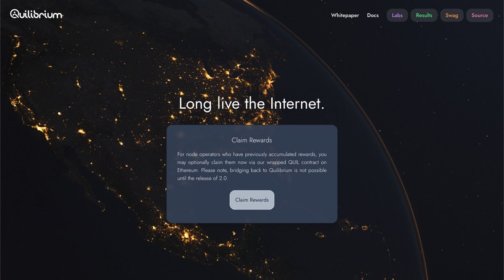
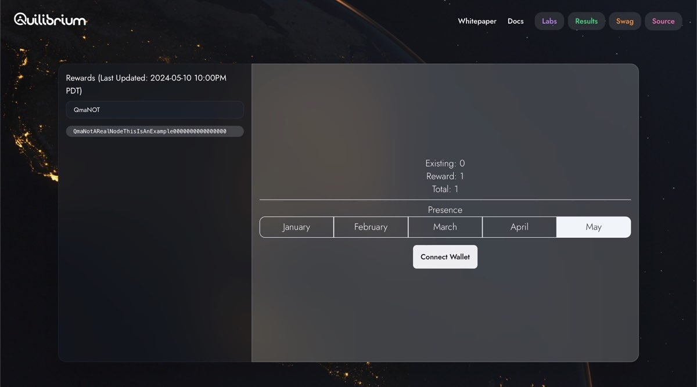
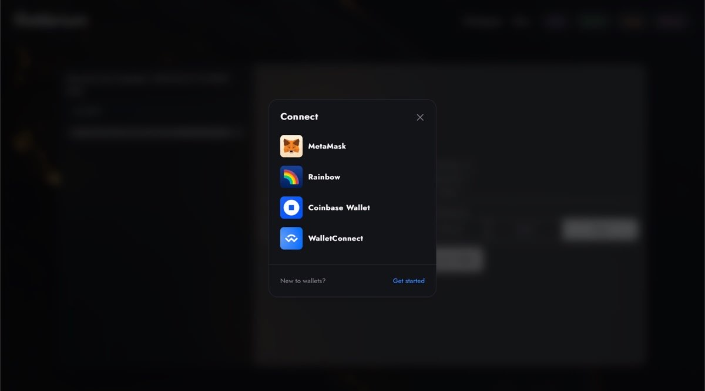
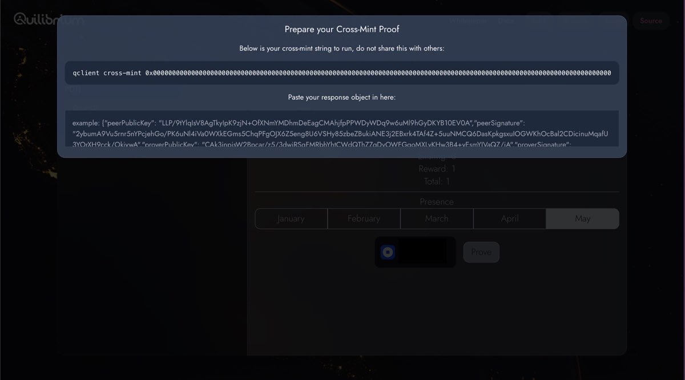
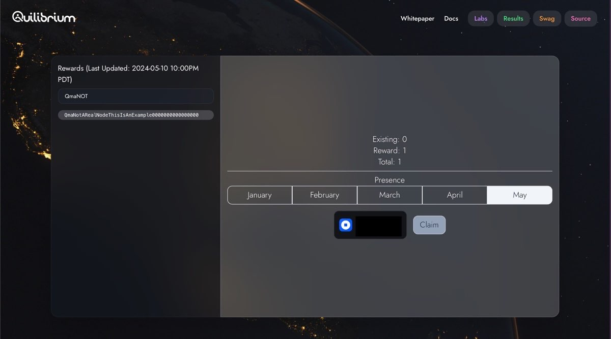
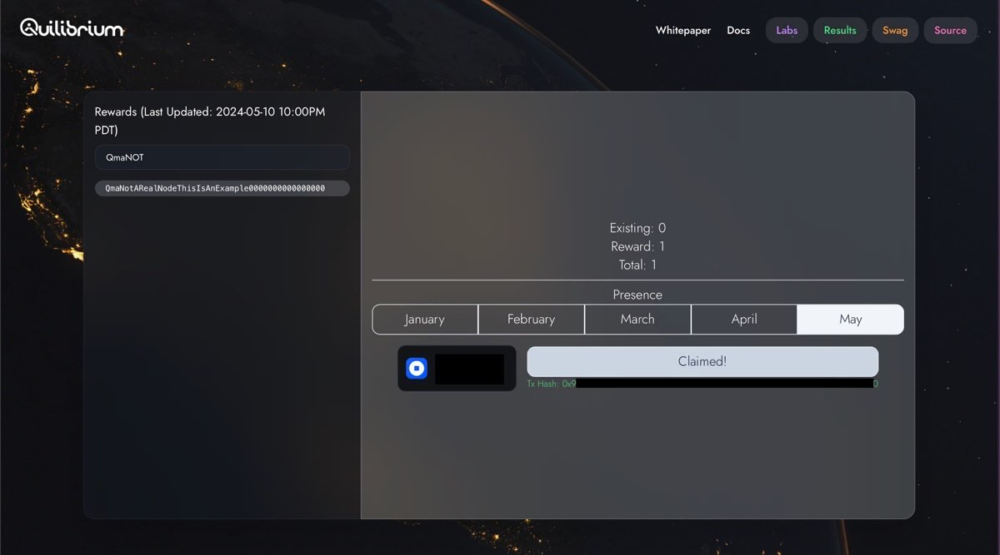

# Claiming wQuil Token

<mark style="background-color:red;">These updates are not currently accessible on the website. Information regarding the completion of the updates and the release of v1.4.18 will be announced soon.</mark>

## About Wrapped Quil Token

wQuil token is the wrapped version of Quil tokens on the Quilibrium Network and represents a 1:1 ratio. It aims to free the circulation of Quil tokens until the Quilibrium cross-chain bridge is active. Currently, it will only be available on ETH Mainnet, and the Quilibrium crosschain bridge is planned to be opened with V2.

### Token Details

Name:

Ticker:

Network: ETH Mainnet

Contract Code:

<mark style="color:purple;">Plase add wQuil as custom token to your EVM wallet!</mark>

## Step-by-Step Claiming

To claim your wQuil tokens, you'll need a functional qClient. Please refer to the relevant page for [qClient installation instructions](cli-commands.md#installing-qclient).

If qClient is installed, you can claim your wQuil tokens via ETH Mainnet by following the steps below.

<mark style="color:orange;">**Important:**</mark> <mark style="color:orange;"></mark><mark style="color:orange;">You can claim all of your rewards at once. Partial claims are not currently supported.</mark>

1. Visit [Quilibrium.com](https://quilibrium.com)

<figure><figcaption></figcaption></figure>

2. Navigate to the Claim Rewards Page and Search for Your Node's Peer ID

<figure><figcaption></figcaption></figure>

3. Please connect your EVM-compatible wallet to proceed.

<figure><figcaption></figcaption></figure>

4. Once you connect your wallet, the website will generate a Cross-Mint Proof specifically for your qClient. This code is necessary to claim your wQuil tokens.

<figure><figcaption></figcaption></figure>

Enter the cross-mint code in your qClient.&#x20;

```bash
cd ceremonyclient/client
./qclient cross-mint 0x000000000000000000000000000000
```

After entering the cross-mint proof in your qClient, copy the resulting output and paste it into the designated field on the website, as shown in the screenshot.


```bash
cd ceremonyclient/client
./qclient cross-mint 0x000000000000000000000000000000
result: ("peerPublicKey": "LLP/9tYlqlsV8AgTky|pK9zjN+OfXNmYMDhmDeEagCMAhjfpPPWDyWDq9w6uM19hGyDKYB10EVOA", "peerSignature": "2ybumA9VuSrnr5nYPcjehGo/PK6uNI4¡VaOWXkEGms5ChqPFgOJX6Z5eng8U6VSHy85zbeZBukiANE3j2EBxrk4TAf4Z+5uuNMCQ6DasKpkgsxulOGWKhOcBa|2CDicinuMqafU 3YOrXH9cck/OkivwA""proverPublicKev": "CAk3innisW2Bocar/75/3dwiRSaFMRbhYhtCWd@Th77aDvOWFGaoMXIvKHw3B4+vFsmYlVaQ7/iA" "proverSianature".
```


**If you use Docker;**


```bash
cd ceremonyclient/
docker compose exec node qclient cross-mint --config .config 0x000000000000000000000000000000
```


6. As a final step, click the "Claim" button and approve any required transactions in your wallet.

<figure><figcaption></figcaption></figure>

5. Congratulations! Your wQuil tokens will be in your wallet shortly. You can monitor the transaction status and check your wallet for confirmation.

<figure><figcaption></figcaption></figure>
