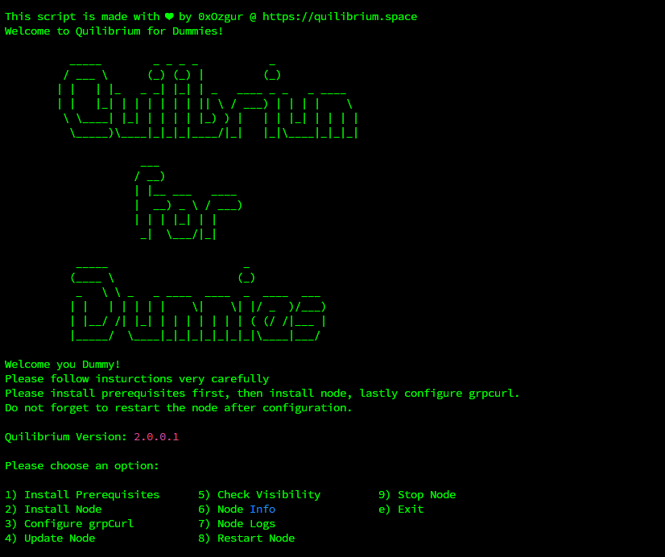

# 🥟 Quilibrium for Dummies

Hi Dummy,

I made small script for easy management of your Quilibrium Nodes.

This is all in one package for most required functions.

<figure><figcaption><p>Quilibrium For Dummies Screenshot</p></figcaption></figure>

If you want to give a try or use, you can download and give first run via that command.


```bash
rm -f quilibrium_for_dummies.sh && wget https://raw.githubusercontent.com/0xOzgur/QuilibriumTools/main/quilibrium_for_dummies.sh && chmod +x quilibrium_for_dummies.sh && ./quilibrium_for_dummies.sh
```


After first run, `./quilibrium_for_dummies.sh` is enough to run again.

Enjoy :)



Please note that, you must reinstall Q for Dummies at every version update!

